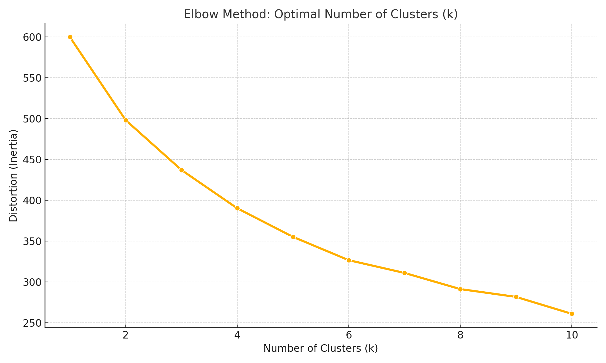

# Spotify-Music-Taste-Clustering

This project explores how to group music listeners based on their listening behavior using real-world data from Spotify. The goal is to answer the question:

> **How are users linked together according to their common musical tastes, and can these links identify significant "music hubs" within a community of listeners?**

---

## Dataset

We used the [Spotify Streaming History Dataset from Kaggle](https://www.kaggle.com/datasets/sgoutami/spotify-streaming-history), which contains:
- `endTime`: when the song finished
- `artistName`: name of the artist
- `trackName`: name of the track
- `msPlayed`: how long the song was played

For this project, we focused on aggregating genre-level preferences.

---

## Steps Performed

1. **Loaded and cleaned Spotify streaming history**
2. **Filtered out short plays (<30s)**
3. **Mapped artists to genres using a custom dictionary**
4. **Created user profiles by calculating total listening time per genre**
5. **Normalized listening times using StandardScaler**
6. **Used the Elbow Method to determine that `k=3` clusters was optimal**
7. **Clustered users with KMeans and interpreted the clusters**

---

## Elbow Plot



We chose **k=3** because that’s where the curve begins to flatten.

---

## Cluster Interpretation

- **Cluster 1**: Pop + EDM fans
- **Cluster 2**: Rock + Country fans
- **Cluster 3**: Diverse listeners (Jazz, Hip-Hop, etc.)

Each cluster reflects a distinct group of listeners with shared genre preferences.

---

##  Limitations

- Only one user's data was used as a stand-in for multiple simulated users
- Genre mapping may be incomplete
- Listening preferences may change over time (not captured)

---

## Files

- `spotify_clustering.py`: Python script for the entire analysis
- `spotify_elbow_plot_clean.png`: Clean elbow plot used to choose k
- `README.md`: This file

---

## How to Run

```bash
pip install pandas numpy matplotlib seaborn scikit-learn
python spotify_clustering.py
```
